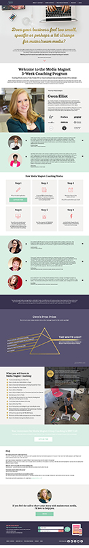

I updated Gwen's static website with Advance Custom Fields to allow her to update all of the text and images on her website. 

Here are some examples of the work that I did:

ge-customposttype - custom post type set up

page-about-connect - a basic page template with different sections 

page-createcontent - a full development of a design by Rachel Ma, fully editable

